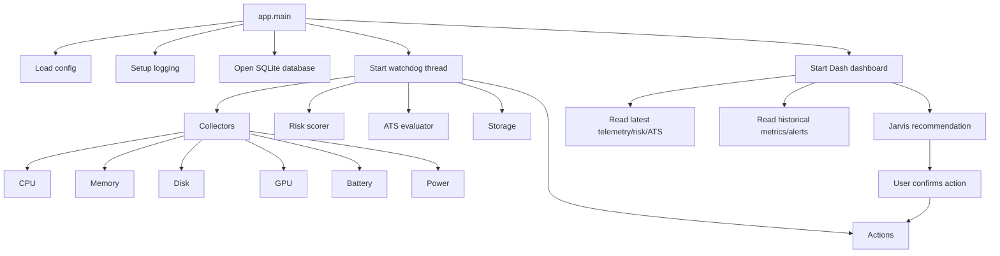

# Laptop Health Guardian - Architecture and Component Documentation

## 1. Purpose

Laptop Health Guardian is a Windows-first local monitoring and mitigation application for laptop thermal health and general maintenance signals.

Its main goals are:

- Collect live hardware and system telemetry.
- Score thermal risk continuously.
- Persist time-series data and alert history locally in SQLite.
- Show a live dashboard in the browser.
- Apply safe mitigation actions for thermal pressure.
- Evaluate maintenance/cleanup signals through ATS logic.
- Let Jarvis recommend actions, including ATS maintenance, with user confirmation.

The application is designed to run entirely on the local machine with no required cloud dependency.

## 2. Current Runtime Model

The runtime is made of two main pieces:

- A background watchdog thread.
- A Dash web dashboard served locally on `127.0.0.1:8050`.

The watchdog continuously collects telemetry, computes risk, evaluates ATS state, stores data, and may trigger safe automated mitigations.

The dashboard reads the latest in-memory state and historical SQLite data, then exposes:

- live metrics,
- recent charts,
- top processes,
- alerts,
- Jarvis recommendations,
- user-confirmed action execution.

## 3. High-Level Architecture



## 4. Repository Layout

### Runtime modules

- `app/main.py`
  Main entry point.
- `app/configuration.py`
  Config defaults, merge logic, validation.
- `app/storage/db.py`
  SQLite schema, migration, persistence API.
- `app/collector/*`
  Hardware/system collectors.
- `app/risk/scorer.py`
  Thermal risk scoring engine.
- `app/watchdog/scheduler.py`
  Background polling loop and automated mitigation flow.
- `app/watchdog/actions.py`
  Power-plan, process-priority, toast, and ATS script execution.
- `app/watchdog/ats_evaluator.py`
  Maintenance scoring logic.
- `app/agent/jarvis.py`
  Action recommendation layer.
- `app/ui/dashboard.py`
  Dash UI and action callbacks.

### Configuration and runtime data

- `config.yaml`
  Main runtime configuration.
- `guardian.db`
  SQLite runtime database.
- `logs/guardian.log`
  Rolling application log.

### Tests

- `tests/test_startup_paths.py`
- `tests/test_db_schema_migration.py`
- `tests/test_collector_snapshot.py`
- `tests/test_ats_evaluator.py`
- `tests/test_jarvis_schema.py`
- `tests/test_risk_scorer.py`

## 5. Startup Sequence

Startup begins in `app/main.py`.

### Step-by-step

1. Resolve project root.
2. Load and validate configuration from `config.yaml`.
3. Resolve relative paths such as:
   - database path,
   - log path,
   - ATS script path.
4. Configure root logging.
5. Warn if the process is not running as Administrator.
6. Open the SQLite database and ensure schema is current.
7. Start the watchdog background thread.
8. Build and run the Dash dashboard.

### Entry command

Use:

```powershell
py -m app.main
```

This is the authoritative startup path.

## 6. Configuration Model

Configuration is handled by `app/configuration.py`.

### Load behavior

- A built-in `DEFAULT_CONFIG` is defined in code.
- `config.yaml` is loaded.
- User values are deep-merged over defaults.
- Validation is applied before runtime starts.

### Active configuration sections

#### `general`

- `sample_interval_seconds`
  Watchdog polling interval.
- `log_retention_days`
  SQLite retention window.
- `db_path`
  SQLite file location.
- `log_path`
  Log file location.
- `dry_run`
  Prevents actual system-changing actions.
- `top_n_processes`
  Number of top processes included in telemetry.

#### `dashboard`

- `host`
- `port`
- `chart_window_minutes`

#### `thresholds`

Used by the thermal risk scorer and ATS temperature trend logic:

- temperature warn/critical
- CPU warn/critical
- RAM warn/critical
- temperature slope warn/critical

#### `risk_weights`

Controls how thermal score is composed:

- absolute temperature,
- temperature slope,
- sustained CPU,
- RAM pressure.

#### `actions`

Controls automation behavior:

- switch to power saver on warning,
- restore prior power plan after cooling,
- lower process priority on warning,
- show toast on critical,
- suspend workloads on critical.

Note:
`suspend_workloads_on_critical` is validated in config but is not currently implemented in runtime logic.

#### `process_allowlist`

- `priority_lower`
  Processes allowed for priority lowering.
- `kill_candidates`
  Processes eligible for termination proposal.

#### `agent`

- `enabled`
- `use_llm`
- `ollama_url`
- `ollama_model`
- `rule_based_fallback`

Notes:

- Jarvis is active as a recommendation layer even without LLM usage because rule-based recommendation is still used.
- `rule_based_fallback` is validated but is not separately used as a branch flag in current runtime.

#### `accountability`

Validated but not materially enforced in runtime behavior yet:

- `policy_version`
- `record_noop_decisions`
- `allow_destructive_actions`
- `block_unconfirmed_actions`

#### `ats`

Active in current runtime:

- `enabled`
- `evaluation_interval_seconds`
- `toast_cooldown_seconds`
- `maintenance_toast_threshold`
- `script_path`

#### `event_log`

Validated but not currently connected to a log-collection feature.

## 7. Telemetry Data Contract

The collector layer returns a nested telemetry object.

### Shape

```python
{
    "timestamp": "2026-03-15T12:00:00+00:00",
    "cpu": {...},
    "memory": {...},
    "disk": {...},
    "gpu": {...},
    "battery": {...},
    "power": {...},
}
```

### CPU section

- `total_pct`
- `per_core_pct`
- `per_core_freq_mhz`
- `temp_celsius`
- `temp_source`
- `top_processes`

Each top process entry contains:

- `pid`
- `name`
- `cpu_pct`
- `mem_pct`
- `io_read_mb`
- `io_write_mb`

### Memory section

- `ram_pct`
- `ram_used_gb`
- `ram_total_gb`
- `pagefile_pct`
- `commit_total_gb`
- `commit_limit_gb`

### Disk section

- `read_mb_s`
- `write_mb_s`
- `free_gb`
- `total_gb`
- `used_pct`
- `queue_length`

### GPU section

- `utilization_pct`
- `source`
- `note`

### Battery section

- `charge_pct`
- `plugged`
- `seconds_left`
- `discharge_rate_w`
- `design_capacity_mwh`
- `full_capacity_mwh`
- `wear_pct`

### Power section

- `plan_guid`
- `plan_name`
- `is_plugged_in`

## 8. Collector Layer

The collector layer is orchestrated by `app/collector/__init__.py`.

It calls each sub-collector and converts dataclasses to dictionaries using `asdict`.

### 8.1 CPU Collector

`app/collector/cpu.py`

Responsibilities:

- total CPU usage,
- per-core usage,
- per-core frequency,
- CPU temperature,
- top processes by CPU.

Temperature strategy order:

1. ACPI thermal zone WMI (`root/wmi`, `MSAcpi_ThermalZone`)
2. OpenHardwareMonitor WMI
3. `psutil.sensors_temperatures()`

If none work, the collector logs a warning and returns `temp_celsius=None`.

Important runtime note:

- On many Windows laptops, native CPU temperature is unavailable.
- LibreHardwareMonitor or a similar WMI-exposing tool improves temperature coverage.

### 8.2 Memory Collector

`app/collector/memory.py`

Uses:

- `psutil.virtual_memory()` for RAM usage,
- WMI `Win32_OperatingSystem` for pagefile and commit statistics.

### 8.3 Disk Collector

`app/collector/disk.py`

Uses:

- `psutil.disk_usage("C:\\")` for capacity,
- `psutil.disk_io_counters()` deltas for throughput,
- WMI perf counters for queue length.

Disk throughput values are based on elapsed time since the prior sample.

### 8.4 GPU Collector

`app/collector/gpu.py`

Uses:

- WMI GPU engine performance counters,
- OpenHardwareMonitor fallback.

Limitations:

- AMD integrated GPU telemetry is often limited through plain Windows counters.
- Current implementation focuses on utilization only.

### 8.5 Battery Collector

`app/collector/battery.py`

Uses:

- `psutil.sensors_battery()` for charge/plugged state,
- WMI battery classes for design/full capacity,
- computes battery wear percentage when possible.

### 8.6 Power Collector

`app/collector/power.py`

Uses `powercfg /getactivescheme` to determine:

- active power-plan GUID,
- current plan name,
- plugged-in state.

## 9. Risk Scoring Engine

Thermal risk is computed in `app/risk/scorer.py`.

### Inputs

- CPU total percent
- CPU temperature
- RAM percent
- temperature slope from recent samples

### Sliding temperature history

The scorer keeps a deque of recent temperature points and computes a slope using a simple linear regression on time vs temperature.

### Components

Each factor is normalized to a 0..1 range:

- absolute temperature,
- temperature slope,
- CPU pressure,
- RAM pressure.

The weighted sum is multiplied by 100 and capped at 100.

### Tier rules

- `CRITICAL`
  score >= 70, or critical temperature, or critical CPU
- `WARN`
  score >= 40, or warning temperature, or warning CPU
- `INFO`
  everything else

### Why low overall score can coexist with high RAM

RAM contributes only `0.10` of total score by default, so high RAM alone can push reasons into warning range without dominating the entire risk score.

## 10. ATS Evaluator

ATS logic lives in `app/watchdog/ats_evaluator.py`.

This is separate from thermal risk.

Thermal risk answers:

- "Is the machine currently under heat/performance stress?"

ATS answers:

- "Does the machine look like it needs cleanup or maintenance?"

### ATS signals

The evaluator computes:

- free disk on `C:`
- temp folder size
- browser cache size
- Docker VHDX size
- Windows Update cache size
- DNS latency
- packet loss
- CPU temperature trend

### Scan model

- Heavy filesystem/network checks are cached for `evaluation_interval_seconds`.
- Temperature trend is updated more frequently using recent telemetry.

### Output

ATS produces an `ATSEvalResult`:

- `maintenance_score`
- `verdict`
- `signals`
- `top_reasons`
- `last_evaluated`
- `fresh_scan`

### Verdict thresholds

- `CLEAN`
  < 20
- `ADVISORY`
  >= 20
- `MAINTENANCE_NEEDED`
  >= 40
- `CRITICAL_MAINTENANCE`
  >= 70

## 11. Watchdog Scheduler

The watchdog loop in `app/watchdog/scheduler.py` is the operational core.

### Cycle behavior

Each cycle:

1. Collect telemetry.
2. Compute thermal risk.
3. Evaluate ATS if enabled.
4. Store latest in-memory state.
5. Insert a metric row into SQLite.
6. Emit ATS recommendation toast if threshold/cooldown conditions are met.
7. Apply automated thermal mitigation if necessary.
8. Purge old database rows hourly.

### In-memory shared state

The scheduler keeps:

- latest telemetry,
- latest thermal risk,
- latest ATS result.

These are exposed to the dashboard via:

- `get_latest()`
- `get_latest_ats()`

### Automated thermal actions

When tier is `WARN`:

- alert row is inserted,
- power saver may be enabled,
- allowed top processes may have priority lowered.

When tier is `CRITICAL`:

- toast notification may be shown,
- a termination request may be proposed for the top process if it is allowlisted.

### Cooling logic

If the system stays below warning for enough cycles, the prior power plan may be restored.

## 12. Actions Layer

System-changing operations are in `app/watchdog/actions.py`.

### Implemented actions

- `switch_to_power_saver()`
- `restore_power_plan()`
- `lower_process_priority()`
- `toast_notification()`
- `request_process_termination()`
- `run_maintenance_script()`

### Safety model

- `dry_run=True` turns actions into no-op logging.
- Process changes require allowlist membership.
- Termination is still only a proposal path, not automatic killing from the dashboard.
- ATS maintenance execution is explicit and user-confirmed through the dashboard flow.

## 13. Jarvis Recommendation Engine

Jarvis lives in `app/agent/jarvis.py`.

It is an action recommender, not the low-level executor.

### Recommendation priority

Current decision order:

1. Thermal rule-based action
2. ATS maintenance recommendation
3. Optional LLM suggestion
4. No action

### Thermal rule-based actions

- `propose_terminate`
- `lower_priority`
- `switch_power_saver`
- `no_action`

### ATS recommendation

If thermal state is nominal and ATS score is at or above `maintenance_toast_threshold`, Jarvis recommends:

- `run_maintenance_script`

with:

- explicit confirmation required,
- non-destructive flag.

### LLM path

If enabled:

- Jarvis sends the telemetry context to an Ollama endpoint,
- expects strict JSON output,
- validates it against a schema.

The schema allows:

- `lower_priority`
- `switch_power_saver`
- `propose_terminate`
- `run_maintenance_script`
- `no_action`
- `notify`

### Schema validation

Validation uses `jsonschema` when installed.

If `jsonschema` is not installed, the application falls back to an internal validator.

## 14. Dashboard

The UI is implemented in `app/ui/dashboard.py` with Dash.

### Main sections

- Header with current status.
- Live tiles:
  - CPU
  - CPU temperature
  - RAM
  - Disk read
  - Disk write
  - Power plan
  - Risk score
- Charts:
  - CPU and temperature
  - RAM and disk I/O
  - thermal risk
- Top processes table
- Alerts panel
- Jarvis recommendation panel
- CSV export button

### Data flow in the UI

- `dcc.Interval` refreshes every 3 seconds.
- The dashboard reads current state from watchdog shared memory.
- Historical charts and alerts come from SQLite.
- Jarvis recommendations are recomputed in the UI callback using current telemetry and ATS state.

### User action flow

When the user clicks `Apply Action`, the dashboard callback routes to:

- power plan change,
- process priority lowering,
- termination request,
- ATS maintenance script launch.

Important:

- ATS maintenance is user-confirmed from the dashboard.
- It is not auto-run by Jarvis.

## 15. Persistence Model

Persistence is handled by `app/storage/db.py`.

### Tables

#### `metrics`

Columns:

- `id`
- `ts`
- `cpu_pct`
- `temp_c`
- `ram_pct`
- `disk_read`
- `disk_write`
- `risk_score`
- `risk_tier`
- `raw_json`

This stores chart-friendly numeric values plus the full telemetry payload in `raw_json`.

#### `alerts`

Columns:

- `id`
- `ts`
- `tier`
- `message`
- `action_taken`

### Migration support

The DB layer detects older schemas and migrates them into the current layout.

Legacy tables are preserved as backup tables named like:

- `metrics_legacy_<timestamp>`
- `alerts_legacy_<timestamp>`

## 16. Logging

`app/main.py` configures root logging with:

- rolling file handler,
- console handler,
- UTF-8 file output,
- 5 MB x 5 rotation.

There is also `app/logging_utils.py`, but the main runtime currently uses `app/main.py` logging setup directly.

## 17. Safety and Governance Model

The design intent is conservative local automation.

### What the app can do automatically

- switch to power saver,
- lower priority of allowlisted processes,
- show toast notifications,
- recommend maintenance,
- ask for termination proposals.

### What the app does not currently do automatically

- directly kill arbitrary processes,
- run ATS maintenance without user confirmation,
- enforce `accountability` policy fields at runtime,
- ingest Windows event logs,
- suspend workloads based on `suspend_workloads_on_critical`.

## 18. Tests and Verification

Current tests cover:

- startup path handling,
- database schema migration,
- collector output shape,
- ATS evaluation behavior,
- Jarvis schema and proposal logic,
- risk scorer behavior.

Run the current test suite subset with:

```powershell
py -m unittest ^
  tests.test_collector_snapshot ^
  tests.test_db_schema_migration ^
  tests.test_startup_paths ^
  tests.test_ats_evaluator ^
  tests.test_jarvis_schema ^
  tests.test_risk_scorer
```

## 19. Known Limitations and Current Caveats

### Temperature coverage

CPU temperature may be unavailable on Windows without a helper such as LibreHardwareMonitor exposing WMI sensors.

### Dev server only

Dash currently runs on Werkzeug's development server. This is fine for local use but is not a production deployment setup.

### Process table semantics

Top processes are currently sorted by CPU percent. That means high RAM usage is not always explained by the visible process list.

### `System Idle Process`

Windows may surface `System Idle Process` in the CPU list. It represents unused CPU time, not an actual workload. The current collector/dashboard do not yet special-case it.

### Unused or partially used config

These sections are present and validated but not fully enforced in runtime:

- `accountability`
- `event_log`
- `actions.suspend_workloads_on_critical`
- `agent.rule_based_fallback`

### Repository support files

The Python entry path is correct, but some support files in the repo are not authoritative for current runtime behavior:

- `README.md` is stale/broken.
- `scripts/run.ps1` is stale/broken.
- `scripts/install_service.ps1` is stale/broken.

Use `py -m app.main` instead.

## 20. End-to-End Runtime Example

Example normal loop:

1. App starts.
2. Watchdog collects telemetry every 3 seconds.
3. Risk score stays low.
4. ATS runs every configured maintenance interval.
5. Dashboard shows live metrics and charts.
6. No automatic action occurs.

Example thermal warning:

1. CPU temperature or CPU load crosses warning threshold.
2. Risk tier becomes `WARN`.
3. Alert row is inserted.
4. Power saver may be enabled.
5. Allowlisted top processes may have their priority lowered.

Example ATS maintenance recommendation:

1. ATS score crosses `maintenance_toast_threshold`.
2. Scheduler may emit a maintenance advisory toast.
3. Dashboard shows ATS score/verdict.
4. Jarvis recommends `run_maintenance_script`.
5. User clicks `Apply Action`.
6. The configured ATS batch file launches.

## 21. Recommended Next Improvements

If you continue evolving this app, the highest-value next steps are:

1. Fix and rewrite `README.md` and the PowerShell helper scripts.
2. Add explicit event log ingestion if `event_log` is intended to be real.
3. Enforce `accountability` policy fields in the executor layer.
4. Exclude pseudo-processes such as `System Idle Process` from mitigation targeting.
5. Add a dedicated memory-heavy process view.
6. Add explicit ATS status/history persistence to the database.
7. Add a service mode or scheduled-task installer that matches the current runtime.
